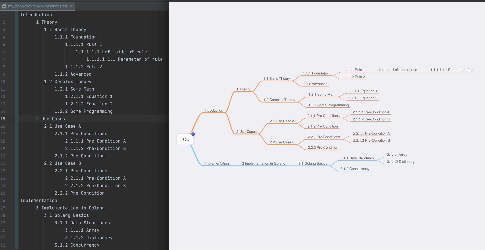

# toc2mm - table of content to mindmap

Creation of a Mindmap from the table of content of a LaTeX document to increase the understandability of the document and make the structure of the document even visible.

## Description

As an author of a LaTex-Document, you edit your document to publish valuable content. Once in a while you compile your document to a pdf. As part of the compiling a toc-file is created that contains the in the "Table of Content" that reflects your document structure. 


When you run the build "toc2mm" software inside your LaTeX-project folder the software will parse the toc-file and creates mindmap from the toc. The mindmap will be stored in a new file as plantuml-syntax inside the LaTeX-project-folder. The author can than use plantuml (on premise installation or online web server) to create a png or svg picture of the mindmap. 

## Getting Started

### Dependencies

* LaTeX:
  * The command "\tableofcontents" must be used inside the tex-document, only then a toc-file will be created
  * The depth of the tabel of conent can be controlled by the following command:
  ```latex
    \setcounter{tocdepth}{5} 
    \setcounter{secnumdepth}{5}
  ```
* Golang, if you want to build your own version

### Installing

* Download the pre compiled version or build your version of the toc2mm software (if you build your own version, please note the build.txt remarks)
* Place the toc2mm software inside your LaTeX-project or somewhere on your machine

### Executing program

Option 1: 
* Place the executable inside your LaTeX-Project
* Start the software (double click)

Option 2:
* Run the software via command line with folder as parameter
```console
foo@bar:~$ toc2mm ".../toc2mm/examples"
```

Finally
* Convert the output via plantuml
```console
foo@bar:~$ java -jar .../plantuml.jar ".../toc2mm/examples"
```

A example from tex via toc to plantuml (on premis) and the to picture via Microsoft VS Code is shown at the following picture. 


## Other output
Beside the plantuml output an additional file is created that reflects the toc structure with intents instead of the plantuml syntax. That output can be for example pasted into MindNode, where the structure than can be viewed and edit like it is show in the picture below.




## Authors

André Wenzel

## Version History

* 0.2.0
  * Command Line options added
* 0.1.1
    * First public Release

## License

This project is licensed under the  MIT License see the LICENSE.md file for details
